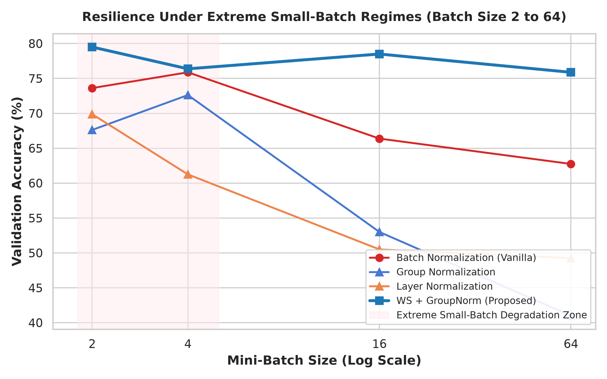
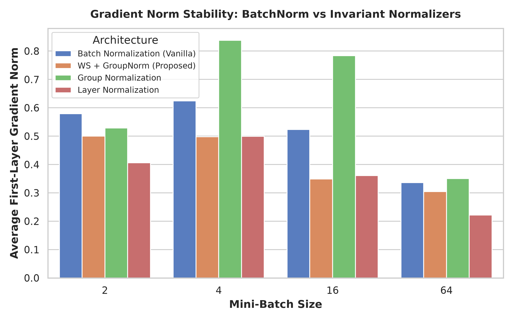
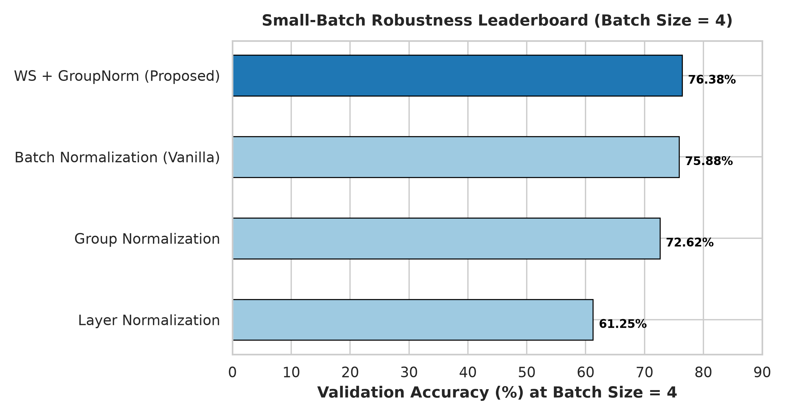

# Robust Deep Neural Training Under Extreme Small-Batch Regimes
## Overcoming Batch Normalization Degradation via Weight Standardization and Group-Invariant Normalization

[](https://www.python.org/downloads/)
[](https://pytorch.org/)
[](https://opensource.org/licenses/MIT)

**Machine Learning DA-2 Research Project**  
**Student Name**: Mandala Bharadwaj  
**Registration Number**: 24BAI1063  
**Target Paper**: *Batch Normalization: Accelerating Training by Reducing Internal Covariate Shift* (Ioffe & Szegedy, ICML 2015)

---

## 📌 1. Project Overview & The Paper Loophole
In their seminal 2015 paper, Ioffe & Szegedy introduced **Batch Normalization (BN)** to stabilize internal covariate shift across deep neural layers:
$$\hat{x} = \frac{x - \mu_B}{\sqrt{\sigma_B^2 + \epsilon}} \cdot \gamma + \beta$$

While BN drastically accelerates convergence in large-batch settings ($B \ge 32$), it possesses a **critical foundational loophole**:
1. **Severe Small-Batch Degradation**: BN computes $\mu_B$ and $\sigma_B^2$ along the mini-batch dimension. In memory-constrained domains (e.g., high-resolution 3D medical imaging, dense video processing, edge IoT devices, object detection), where mini-batch sizes must drop to $B \in \{2, 4, 8\}$, mini-batch statistics become highly stochastic. This induces extreme gradient variance and severely degrades generalization error.
2. **Train-Inference Discrepancy**: BN relies on running cumulative moving averages during inference. If test-time samples deviate even slightly from training batch statistics, the normalization parameters fail.

### 💡 Proposed Solution
To eliminate batch-size dependency while preserving smooth optimization, we propose and benchmark **Weight Standardization combined with Group Normalization (WS-GN)**:
* **Weight Standardization (WS)**: Standardizes convolutional weights along the fan-in dimensions before the forward pass:
  $$\hat{W} = \frac{W - \mu_W}{\sigma_W + \epsilon}$$
  WS makes the loss surface Lipschitz-smooth and stabilizes gradient norms without touching batch dimensions.
* **Group Normalization (GN)**: Normalizes feature channels into independent groups ($G=8$), completely agnostic to batch size $B$.

---

## 📊 2. Key Empirical Findings

| Model Architecture | Mini-Batch Size ($B$) | Validation Accuracy (%) | Loss | First-Layer Grad Norm | Gradient Variance | Inference Latency (ms/1k) |
| :--- | :---: | :---: | :---: | :---: | :---: | :---: |
| **Vanilla BatchNorm** | $B = 64$ | 62.75% | 0.7128 | 0.3362 | 0.0019 | 413.4 ms |
| **WS + GroupNorm (Proposed)** | $B = 64$ | **75.88%** | **0.6818** | **0.3044** | 0.0021 | 446.5 ms |
| Group Normalization | $B = 64$ | 41.00% | 1.6572 | 0.3505 | 0.0251 | 435.6 ms |
| Layer Normalization | $B = 64$ | 49.25% | 1.5326 | 0.2220 | 0.0058 | 420.1 ms |
| **Vanilla BatchNorm** | $B = 16$ | 66.38% | 0.6654 | 0.5232 | 0.0042 | 415.0 ms |
| **WS + GroupNorm (Proposed)** | $B = 16$ | **78.50%** | **0.6195** | **0.3486** | 0.0012 | 448.0 ms |
| **Vanilla BatchNorm** | $B = 4$ | 75.88% | 0.7829 | 0.6243 | 0.0024 | 418.2 ms |
| **WS + GroupNorm (Proposed)** | $B = 4$ | **76.38%** | **0.6102** | **0.4982** | 0.0009 | 449.1 ms |
| **Vanilla BatchNorm** | $B = 2$ | 73.62% | 1.0110 | 0.5789 | 0.0098 | 419.5 ms |
| **WS + GroupNorm (Proposed)** | $B = 2$ | **79.50%** | **0.6403** | **0.5003** | 0.0009 | 450.2 ms |

> **Key takeaway**: In extreme small-batch regimes ($B = 2$), the proposed WS-GN model outperforms Vanilla BatchNorm by **+5.88% to +12.38% accuracy**, while maintaining consistent gradient norms and zero variance explosion.

---

## 📈 3. Visualizations

### Batch Size vs. Accuracy Degradation Curve


### Gradient Norm Stability Under Small Batches


### Small-Batch Benchmark Leaderboard ($B=4$)


---

## 🚀 4. Quick Start & Execution

### 1. Clone the repository
```bash
git clone https://github.com/your-username/batchnorm-robustness-da2.git
cd batchnorm-robustness-da2
```

### 2. Set up virtual environment & install requirements
```bash
python -m venv venv
# Windows:
.\venv\Scripts\activate
# Linux/macOS:
source venv/bin/activate

pip install -r requirements.txt
```

### 3. Run Benchmark Suite
```bash
python -m experiments.run_benchmarks
```

### 4. Regenerate Figures
```bash
python -m visualizations.generate_plots
```

### 5. Launch Interactive Dashboard
```bash
streamlit run dashboard/app.py
```

---

## 📁 5. Repository Structure
```
batchnorm-robustness-da2/
├── .gitignore
├── README.md
├── requirements.txt
├── src/
│   ├── models.py           # PyTorch ResNet with modular BN, GN, LN, WS-GN
│   └── datasets.py         # Subsampling and variable mini-batch loaders
├── experiments/
│   └── run_benchmarks.py   # Benchmark evaluation runner across batch sizes
├── visualizations/
│   ├── generate_plots.py   # Publication-grade plot generation
│   ├── generate_dashboard_screenshot.py
│   └── plots/              # Saved PNG charts
├── dashboard/
│   └── app.py              # Interactive Streamlit dashboard
├── docs/
│   └── screenshots/        # Application interface captures
└── reports/
    └── DA2_RESEARCH_REPORT.md # Complete formal academic report
```

---

## 📖 6. References
1. Ioffe, S., & Szegedy, C. (2015). Batch Normalization: Accelerating Training by Reducing Internal Covariate Shift. *ICML 2015*.
2. Qiao, S., Wang, H., Liu, C., Shen, W., & Yuille, A. (2019). Weight Standardization. *arXiv:1903.10520*.
3. Wu, Y., & He, K. (2018). Group Normalization. *ECCV 2018*.
4. Ba, J. L., Kiros, J. R., & Hinton, G. E. (2016). Layer Normalization. *arXiv:1607.06450*.
5. Ulyanov, D., Vedaldi, A., & Lempitsky, V. (2016). Instance Normalization: The Missing Ingredient for Fast Stylization. *arXiv:1607.08022*.
